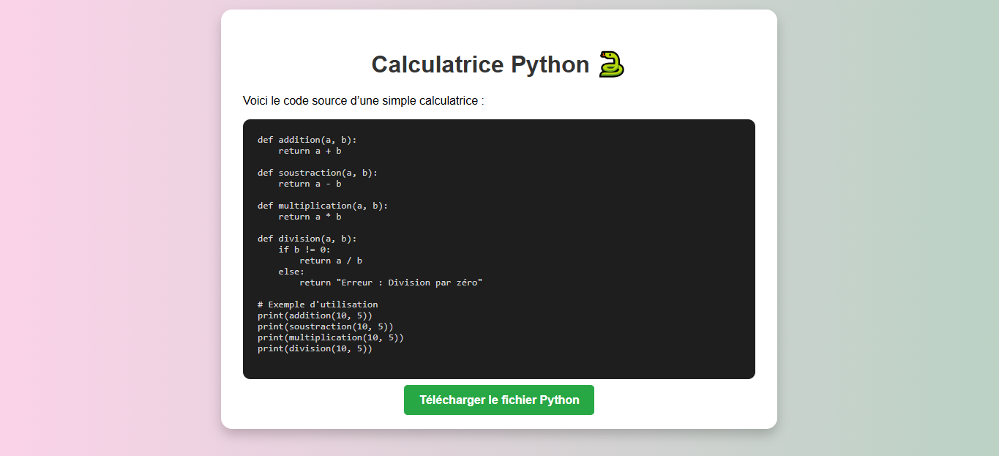

# 🧮 Calculatrice Python – Version Web
---

<p align="center">
  
</p>


---
Ce projet est une **calculatrice simple**, d’abord développée en Python puis adaptée en version Web.

Elle permet de réaliser les opérations arithmétiques de base dans une interface propre, claire et responsive.

## 🌐 Démo en ligne

👉 **Calculatrice Web :** [**https://bucolic-semifreddo-1ad3c5.netlify.app/**](https://bucolic-semifreddo-1ad3c5.netlify.app/)

  

Hébergée avec **Netlify**.

## 📌 Fonctionnalités

-   ➕ Addition
-   ➖ Soustraction
-   ✖️ Multiplication
-   ➗ Division
-   🛡️ Gestion de la division par zéro
-   🎨 Interface simple, lisible et intuitive

## 🎨 Design

-   Interface minimaliste
-   Couleurs sobres
-   Affichage propre des opérations
-   Compatible mobile & desktop

## 🧠 Technologies utilisées

### 🔹 Version Web

-   **HTML5**
-   **CSS3**
-   **JavaScript**

### 🔹 Version Console

-   **Python** (calculatrice.py) – code source d’origine

## 📁 Structure du projet
```
.
├── index (1).html
├── calculatrice.py     # version console
└── README.md
```

## 🚀 Installation

### 1\. Cloner le projet

git clone https://github.com/Ayoub-glitsh/Calculatrice-Python.git

### 2\. Ouvrir dans un navigateur

Ouvre simplement **index (1).html**

Pour un serveur local (optionnel) :

-   Avec VS Code → extension **Live Server**

## 🔧 Exemple du code Python d’origine

def addition(a, b):
    return a + b

def soustraction(a, b):
    return a - b

def multiplication(a, b):
    return a \* b

def division(a, b):
    if b != 0:
        return a / b
    else:
        return "Erreur : Division par zéro"

## 💡 Améliorations possibles

-   Historique des calculs
-   Mode scientifique
-   Mode sombre / clair
-   Animations CSS
-   Son pour les touches

Si tu veux, je peux t’aider à les ajouter 😉

## 👨‍💻 Auteur

**Ayoub Aguezar**
Développeur Web Full-Stack 
